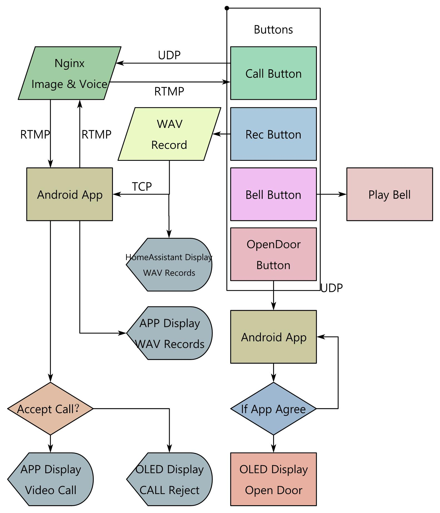

# Smart Door Control System User Manual

## Table of Contents
- [Overview](#overview)
- [Prerequisites](#prerequisites)
- [Installation](#installation)
- [Configuration](#configuration)
- [Hardware Setup](#hardware-setup)
- [Functionality Guide](#functionality-guide)
  - [Doorbell Operation](#doorbell-operation)
  - [Call Management](#call-management)
  - [Audio Recording](#audio-recording)
  - [Door Control](#door-control)
- [MQTT Integration](#mqtt-integration)
- [Troubleshooting](#troubleshooting)
- [Safety & Best Practices](#safety--best-practices)

---

## Overview
The main python file is `\SamrtDoorbell\door8.py`.

This system integrates an OLED display, physical buttons, audio I/O, and network protocols to enable:
- Voice calls over UDP/TCP
- Audio recording/playback
- Doorbell activation
- Door control via servo motor
- Remote control via MQTT


---

## Prerequisites

### Hardware
- Raspberry Pi (or similar SBC)
- SSD1306 OLED (I2C interface)
- 4x Tactile buttons
- Microphone & Speaker
- Servo motor (door control)
- LED (status light)

### Software
- Python 3.7+
- Required libraries:
  ```bash
  pip install luma.oled gpiozero pyaudio paho-mqtt smbus
  ```

---

## Installation

1. Clone the repository:
   ```bash
   git clone https://github.com/zzlkk0/Smart-Doorbell.git
   cd Smart-Doorbell/SmartDoorbell
   ```

2. Install dependencies:
   ```bash
   sudo apt-get install libportaudio2 portaudio19-dev libasound2-dev
   pip install -r requirements.txt
   ```

---

## Configuration

### Network Settings
In your Python script:
```python
# UDP Server
udp_server_address = ('192.168.211.51', 8699)

# TCP Server (Audio transfer)
tcp_server_address = ('192.168.211.51', 8700)

# MQTT Broker
MQTT_BROKER = "192.168.1.115"
MQTT_PORT = 1883
```

### Audio Settings
```python
# RTMP Stream
audio_player = VLCAudioPlayer("rtmp://0.0.0.0:8889/live2/stream")

# Doorbell Sound File
DOORBELL_SOUND = "/home/link/doorbell/doorbell.wav"
```

---

## Hardware Setup

| Component       | GPIO Pin |
|----------------|----------|
| Button 1 (Rec) | 21       |
| Button 2 (Call)| 27       |
| Button 3 (Bell)| 22       |
| Button 4 (Door)| 23       |
| LED            | 16       |
| Servo Motor    | 13       |

---

## Functionality Guide

### Doorbell Operation

#### Local Trigger
- Press **Button 3** (GPIO 22)
- OLED displays:  
  ```
  Doorbell
  ringing
  ```
- System behavior:
  - Speaker volume lowers to 50%
  - Plays `doorbell.wav`
  - Volume restores after playback
  - Returns to default screen after 2 seconds

#### Remote Trigger
Send MQTT message:
```bash
mosquitto_pub -h 192.168.1.115 -t "/homeassistant/sent/bell" -m "1"
```

---

### Call Management

#### Placing a Call
- Press **Button 2** (GPIO 27)
- OLED shows: `Calling...`
- UDP sends `CALL_REQUEST` to server
- Starts 10-second timeout

#### Accepting a Call
- Server sends `ACCEPT_CALL` via UDP
- OLED updates to: `Call answered`
- Starts RTMP audio stream
- Displays call duration (e.g., `Talking 15s`)

#### Ending a Call
- Press Button 2 again:
  - OLED: `Call ended`
  - Sends `HANG_UP` via UDP  
- Or remote termination:
  - Server sends `HANG_UP`
  - System auto-terminates

---

### Audio Recording
- Press **Button 1** (GPIO 21)
- OLED displays:  
  ```
  Recording...
  ```
- Records 10 seconds
- Saves as `output1.wav`
- Automatically uploads via TCP

---

### Door Control

#### Local Operation
- Press **Button 4** (GPIO 23)
- Sends `OPEN_DOOR_REQUEST` via UDP
- OLED displays:  
  ```
  Open request
  has been sent
  ```

#### Remote Operation
Send MQTT message:
```bash
mosquitto_pub -h 192.168.1.115 -t "/homeassistant/sent/door" -m "1"
```
- Servo motor turns (e.g., to 90°)
- LED lights up during motion

---

## MQTT Integration

| Topic                         | Direction | Payload | Action                      |
|------------------------------|-----------|---------|-----------------------------|
| /homeassistant/sent/door     | IN        | 1       | Triggers door opening       |
| /homeassistant/sent/light    | IN        | 1 / 0   | LED control (GPIO 16)       |
| /homeassistant/sent/bell     | IN        | 1       | Remote doorbell trigger     |
| /homeassistant/recording     | OUT       | 1 / 0   | Recording status updates    |

---

## Troubleshooting

| Issue                  | Solution                                                                 |
|------------------------|--------------------------------------------------------------------------|
| Doorbell not sounding  | 1. Verify `doorbell.wav` exists<br>2. Add audio permissions:<br>`sudo usermod -a -G audio pi` |
| Call audio distortion  | 1. Confirm RTMP server is running<br>2. Check network latency with:<br>`ping 192.168.1.115` |
| OLED display blank     | 1. Check I2C address:<br>`i2cdetect -y 1`<br>2. Verify solder connections |
| MQTT connection failed | 1. Check broker IP/port<br>2. Allow port with:<br>`sudo ufw allow 1883` |

---

## Safety & Best Practices

### Electrical Safety
- Use 3.3V logic level for GPIO
- Add 1kΩ resistors in series with buttons

### Servo Maintenance
- Lubricate gears every 3 months
- Avoid operation longer than 15 seconds continuously

### Software Updates
```bash
sudo apt-get update && sudo apt-get upgrade
pip freeze --local | grep -v '^\-e' | cut -d = -f 1 | xargs -n1 pip install -U
```

### Emergency Stop
- Add a hardware kill switch between Pi and motor power supply
